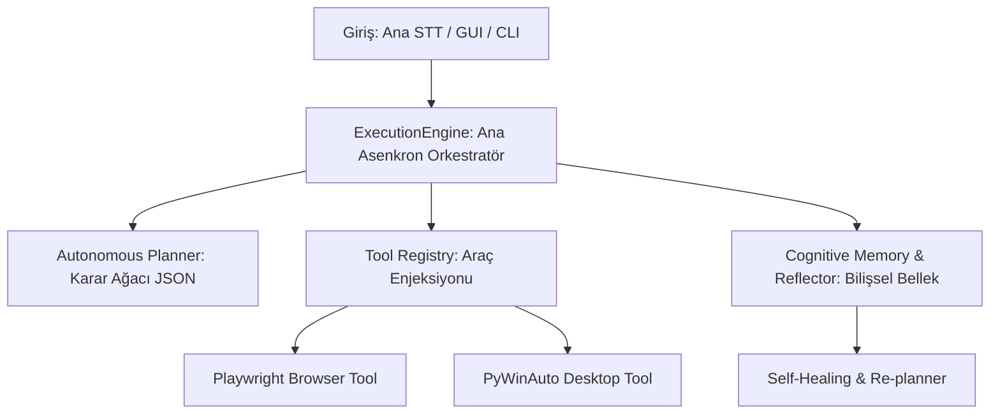

# 🧠 J.A.R.V.I.S. v12.0 — Autonomous Cognitive OS & Agent Architecture 🚀

[](https://www.python.org)
[](https://docs.python.org/3/library/asyncio.html)
[](https://playwright.dev)
[](https://huggingface.co)
[](https://www.trychroma.com/)

**J.A.R.V.I.S. (Just A Rather Very Intelligent System)**, tek yönlü bir komut betiğinden tamamen bağımsız karar alabilen, kendi hatalarını düzelten (**self-healing**), epizodik hafızaya ve dinamik yeniden planlama yeteneğine sahip **v12.0 Otonom Bilişsel İşletim Sistemi** ve Ajan mimarisidir.

Tamamen `asyncio` asenkron mimarisi üzerine kurulu olan J.A.R.V.I.S., karmaşık hedefleri dinamik alt görev ağaçlarına dönüştürerek tarayıcı, masaüstü uygulamaları ve sistem donanımları üzerinde otonom görevler yürütür.

---

## 🏛️ Gelişmiş Mimari ve Alt Sistemler



### 1. Ana Asenkron Orkestratör (`core/engine.py`)
Sistemin merkez üssüdür. Komutları ardışık sırayla çalıştırmak yerine, dinamik bir asenkron `TaskQueue` (Görev Sırası) yönetir. 
*   **Paralel Durum Takibi:** `StateManager` ile tüm asenkron görev durumlarını eş zamanlı takip eder.
*   **Bloke Etmeyen G/Ç:** `asyncio.gather()` ve asenkron I/O yapıları sayesinde ses, arayüz ve araç yürütme işlemlerini birbirini kilitlemeden asenkron yürütür.
*   **Akıllı Kurtarma:** İşlem sırasında oluşan hataları saptayıp otomatik yeniden planlama (`_replan`) modülüne aktarır.

### 2. Otonom Planlayıcı & Ağaç Yapısı (`core/planner.py` - Katman 0)
Karar mekanizması, dil modellerinin çıktılarını katı kurallı (strictly-typed) JSON formatına zorlayan bir ağaç modeline dayanır.
*   **Katman 0 (Ağaç Planlama):** LLM, hedefe ulaşmak için gereken alt görevleri, parametreleri ve bağımlılıkları `PlanNode` nesnelerinden oluşan hiyerarşik bir ağaç yapısı olarak kurar.
*   **Katman 1-4 (Regex Fallback):** LLM çıktısının bozulduğu ekstrem durumlarda bile sistemin çalışmaya devam etmesini sağlayan geriye dönük uyumlu Regex ayrıştırma motoru.

### 3. Bilişsel Bellek & Öz-Yansıma (`core/memory.py` & `core/reflector.py`)
J.A.R.V.I.S., statik bilgi saklamak yerine **bilişsel yansıma ve tecrübe edinme** mekanizmaları barındırır:
*   **Öz-Yansıma (Reflector):** Yürütülen her görev veya yaşanan her başarısızlık sonrasında *"Ne yanlış gitti?", "Hangi araç işe yaradı?"* sorularına yanıt arayarak hatanın kök nedenini analiz eder.
*   **Episodik Bellek (Episodic Memory):** Yaşanan tecrübeleri, hata kodlarını ve başarılı çalışma metriklerini yerel veri tabanı vektör semantik eşleştirmesi ile hafızada tutar. Benzer bir görevle karşılaşıldığında geçmişteki çözümü otonom olarak hatırlar.
*   **Kişisel & Başlangıç Hafızası:** `[PROTOCOL: REMEMBER]` ve `[PROTOCOL: STARTUP_REMINDER]` araçları sayesinde uzun süreli kişisel verileri güvenli şekilde depolar ve sistem açılışlarında planlanmış hatırlatmaları size bildirir.

### 4. Dinamik Yeniden Planlama (Self-Healing - Kendi Kendini İyileştirme)
Eğer bir işlem sırasında beklenmeyen bir engel (hata, kısıtlama, web sitesinin değişmesi vb.) oluşursa:
1.  Görev sırası durdurulur (`cancel_all`).
2.  `Reflector` devreye girerek hatayı ve çevre değişkenlerini analiz eder.
3.  Elde edilen analiz verileri ve kalan hedefler yapay zekaya sunularak **otonom olarak tamamen yeni bir alt plan (sub-plan)** üretilir.
4.  J.A.R.V.I.S. kullanıcıya hiçbir hata ekranı yansıtmadan, hedefe giden yeni rotadan çalışmaya devam eder.

### 🛠️ 5. Durumsuz Eklenti Tabanlı Araç Sistemi (`tools/`)
Tüm araçlar, `ToolRegistry` aracılığıyla asenkron intent (niyet) eşleştirmesi yapan durumsuz modüller olarak tasarlanmıştır:
*   🌐 **`browser_tool.py`**: Arama motorlarını tarama, veri çekme ve web otomasyonu için tasarlanmış başlı/başsız (headed/headless) **Playwright** entegrasyonu.
*   🖥️ **`desktop_tool.py`**: İşletim sistemi seviyesinde yerel Windows uygulamalarını kontrol etmek için **PyWinAuto** bağlayıcıları.
*   ⚙️ **`system_tool.py`**: Sistem kaynakları, donanım durumları ve dosya sistemi işlemleri için yerel araçlar.

---

## 🔒 Güvenlik ve Gizlilik Politikası

J.A.R.V.I.S. tamamen **güvenli yerel mimari (local-first)** prensibiyle çalışır:
*   **Yerel Bellek Veritabanı:** Bellek ve semantik deneyim kayıtları bilgisayarınızdaki yerel `memory_db/` klasöründe saklanır, dış sunuculara gönderilmez.
*   **Hassas Veri Koruması (`.gitignore`):** `.env` (API Anahtarları), `contacts.json` (Kişisel Telefon ve WhatsApp İletişimleri), `.coverage` ve yerel log/hata dosyaları optimize edilmiş Git dışlama listesiyle korunmaktadır. Kazara GitHub'a sızma riski yoktur.

---

## 🚀 Kurulum ve Çalıştırma

### 1. Gereksinimler
*   **Python 3.11:** En iyi asenkron performans için Python 3.11.x önerilir.
*   **Playwright Kurulumu (Web Otomasyonu İçin):**
    ```bash
    pip install playwright
    playwright install
    ```

### 2. Bağımlılıkları Yükleyin
```bash
pip install -r requirements.txt
```

### 3. Çevre Değişkenleri
Ana dizinde bir `.env` dosyası oluşturarak dil modeli ve API anahtarlarınızı girin:
```env
OPENAI_API_KEY=your-openai-api-key
# Varsa diğer API veya HuggingFace token bilgileriniz
```

### 4. Çalıştırma Seçenekleri
*   **Seçenek A (Konsol Modu):**
    ```bash
    python main.py
    ```
*   **Seçenek B (Arayüz Modu - GUI):**
    ```bash
    python launch_jarvis.pyw
    ```
*   **Seçenek C (Windows Başlangıç):**
    `install_startup.bat` betiğine çift tıklayarak J.A.R.V.I.S.'in Windows açılışında arka planda otomatik olarak hazır hale gelmesini sağlayabilirsiniz.

---

## 👤 Geliştirici Hakkında

Bu proje, **Oğuz Emir Topuz** tarafından geliştirilmiştir.

*   **Yaş:** 14
*   **İlgi Alanları & Tutkular:** Futbol tutkunu ve aynı zamanda ileri düzey bir yazılım geliştiricisi.
*   **Neler Yapıyor?** SaaS uygulamaları, modern ve şık web siteleri ve 3D oyunlar üzerinde çalışıyor.
*   **İletişim & Portfolyo:** [GitHub Profilim](https://github.com/OguzEmir177)

---

⭐ Bu projeyi beğendiyseniz yıldız (star) vermeyi unutmayın! Geliştirilmeye devam edecektir.
