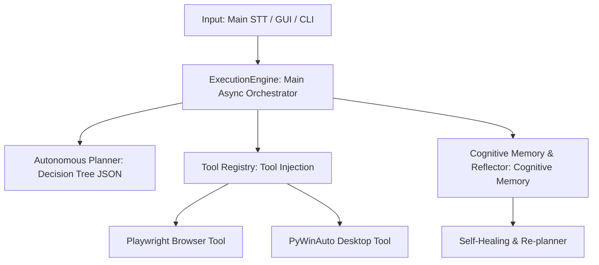

# 🧠 J.A.R.V.I.S. v16.2.0 — Autonomous Cognitive OS & Agent Architecture 🚀

[](https://www.python.org)
[](https://docs.python.org/3/library/asyncio.html)
[](https://playwright.dev)
[](https://huggingface.co)
[](https://www.trychroma.com/)

**J.A.R.V.I.S. (Just A Rather Very Intelligent System)** is an **Autonomous Cognitive Operating System** and Agent architecture featuring episodic memory, a self-healing re-planning capability, and dynamic tree-based JSON planning that acts completely independently of one-way command scripts.

Fully built on the `asyncio` asynchronous architecture, J.A.R.V.I.S. breaks down complex goals into dynamic sub-task trees to run autonomous tasks across browsers, desktop applications, and system hardware.

---

## ✨ Latest Release (v16.2.0)
> [!IMPORTANT]
> **Post-Audit Hardening, Optimization & 1-Click Installer**
> * **[Security] Un-bypassable AST Sandbox:** Enhanced AST validation of `DynamicSkillSynthesizer` to block all potential sandbox escape vectors. Direct built-in manipulation (`__import__`, `getattr`, `setattr`, `globals`, `locals`, `compile`) and dunder attributes (`__builtins__`, `__dict__`, `__class__`, etc.) are now strictly blocked. Validation runs entirely asynchronous in a thread pool to avoid blocking the event loop.
> * **[Optimizations] Memory Leak Fix & Semantic Routing Threshold:** Addressed a critical memory leak in `SemanticRouter` during TF-IDF vector pruning (previously leaving obsolete elements in lists). Relocated heavy TF-IDF matrix refitting to `run_in_executor`. Expanded confidence routing; scores between `0.30 <= score < 0.65` now match with `is_forced=False`, keeping the local matching speed while leaving final validation to the cognitive LLM, rather than dropping them entirely.
> * **[Installer] 1-Click System Setup (`install.bat`):** Added a new, fully automated 7-step installer for Windows systems. It sets up Python `venv`, fetches and configures FFmpeg, manages `.env` and `contacts.json` configs, installs requirements, and places a pre-configured J.A.R.V.I.S. shortcut on the desktop.

---

## 📜 Changelog

### 🚀 v16.2.0 — Post-Audit Hardening & 1-Click Installer
* **[Security] Un-bypassable AST Sandbox:** Strengthened dynamic skill synthesis security by blocking dunder elements (`__builtins__`, `__dict__`) and core utilities (`__import__`, `getattr`, `setattr`, etc.). Moved AST security scans to async threads.
* **[Optimizations] Async Vector Re-Fitting & Pruning Leak:** Fixed an index shifting memory leak in local `SemanticRouter` dynamic cache pruning. Vector space matrix calculations are now executed asynchronously to prevent blocking the event loop.
* **[Optimizations] Smart Router Threshold:** Re-calibrated local confidence scoring where scores between `0.30` and `0.65` fall back to the LLM gracefully as soft matches (`is_forced=False`), maximizing vector utility while ensuring cognitive fallback.
* **[Installer] 1-Click Setup (`install.bat`):** Shipped a full 7-step installer that automates virtual environment setup, local FFmpeg downloads/extracts, and generates desktop shortcuts.

### 🔒 v16.1.0 — Code Freeze Audit
* **[Security] Extended AST Sandbox:** Updated `DynamicSkillSynthesizer` AST verification to block shell-executing attributes/methods (e.g., `os.system()`, `subprocess.*`) in generated code with `SecurityViolationError`.
* **[Async] Fixed AdaptiveLearner Event-Loop Poisoning:** Shifted file write I/O in `_save_strategies()` to a thread pool using `run_in_executor` when the event loop is active.
* **[Fail-Fast] Disabled Silent Exception Swallowing:** Replaced silent logging with explicit `logger.error()` reports and refined exception handling during strategy loading.
* **[Async] Resolved Unawaited Future in Semantic Router:** Wrapped unawaited executor calls in a clean async pattern using `asyncio.ensure_future` to safely bubble up warnings via `logger.warning()`.

### 🌟 v16.0.0 — The AGI Update: Dynamic Skill Synthesizer
* **Tool Synthesis (Build Your Own Tool):** The system no longer gives up when facing an unknown task. Using the LLM, it synthesizes asynchronous Python code (inheriting from `BaseTool`) that executes the task, saves it in the `tools/dynamic_skills/` directory, and injects it into the `ToolRegistry` via Hot-Reload without needing to restart the system.
* **AST-Based Security Sandbox:** To prevent LLM-generated code from taking over the system (Security Vulnerability), generated code is scanned using the *Abstract Syntax Tree (AST)* before execution. Dangerous functions like `eval` and `exec`, as well as non-whitelisted module imports, are blocked immediately, preventing system crashes under the Fail-Fast principle.
* **Full Asynchronous Isolation:** Dynamic code generation, disk writing, and dynamic module import (`importlib`) operations are fully placed behind `run_in_executor`, ensuring J.A.R.V.I.S.'s event loop is not blocked for even a microsecond.

### 🚀 v15.0.0 — Autonomous Self-Learning Loop (Dynamic Embedding Cache)
* **Self-Learning Router:** The Semantic Router is now integrated with the `Dynamic Embedding Cache`. After delegating unknown commands (Confidence < 65%) to the LLM, the system saves successfully executed commands and their arguments (`User Sentence -> Tool Tag + Args`) to a local JSON database using an asynchronous I/O architecture.
* **Smart Pruning and RAM Control:** The autonomous cache size is capped at 1000 commands. Once the capacity is reached, the least valuable vectors are automatically pruned using Least-Recently Used / Least-Frequently Used (LRU/LFU) logic, preventing RAM and Disk bloat.
* **Fail-Fast Integration:** All data-loading phases are purged of fake `except: pass` blocks, ensuring the system crashes directly in case of corrupted data to provide immediate feedback.

### 🧠 v14.0.0 — Local Semantic Router (Zero-Latency Routing)
* **LLM-Independent (Zero-Cost) Routing:** The old `AutonomousToolRouter` with its complex spaghetti code (heavily nested If/Else and Regex) was completely removed! It is replaced by a pure machine learning-based `SemanticRouter` using `scikit-learn` TF-IDF and Cosine Similarity.
* **Millisecond Response Time:** Simple and clear commands (e.g., "Open Google", "Shut down PC", "Stop music") are matched in the local vector space in milliseconds and executed directly, without hitting the LLM (GroqBrain).
* **Ambiguity Gate:** If the router confidence score is below 65% (indicating a complex command), the system automatically falls back to the LLM (GroqBrain). The LLM is used only for tasks that actually require cognitive intelligence.

### 🛡️ v13.3.0 — Enterprise-Grade "Fail-Fast & Async" Architecture Update
* **Fail-Fast Principle:** In the connection checks of the `core/brain.py` and `core/engine.py` modules, the amateurish `except: pass` exception swallowing logic was completely removed. In case of API or model errors, instead of running in a limited mode, the system crashes honestly according to enterprise standards and returns a clear log (`SystemError`) to the user.
* **Async Alignment & Bottleneck Resolutions:** Discovered blocking I/O operations (file reads) in the event loop during startup (`_check_startup_reminders`). All startup I/O processes have been converted to enterprise async standards, offloading them using `run_in_executor` to prevent Event Loop poisoning.
* **Enhanced Debugging Capability:** Logs produced upon system crashes are enriched with details that clearly point out where the issue originated (API, model, or network).


---

## 🆕 What's New in v13.2 — Project "Ghost Shield"

J.A.R.V.I.S. v13.2 introduces critical improvements to the voice interaction layer and update management:

### 1. 🛡️ Whisper Hallucination Shield ("Ghost Shield")
* **Low-Energy RMS Gate:** Prevents silent or low-volume audio bytes from being sent to the Whisper API. If the audio level is below **350 RMS**, the pipeline discards it instantly locally, saving API token costs and bandwidth.
* **Semantic Blocklist:** Autonomously detects and blocks common Turkish Whisper silence hallucinations such as *"altyazı m.k."*, *"like atın"*, *"abone ol"*, and English defaults like *"thanks for watching"*.
* **Smart Noise Gate:** Automatically discards short voice signals containing only vocal fillers (`ıı`, `ee`, `yani`, etc.) to prevent false intent activations.

### 🔄 2. One-Click Auto-Updater (`update.py`)
No Git? No problem! J.A.R.V.I.S. now ships with a native, zero-dependency update orchestrator.
* **How it works:** Simply run `python update.py`. The script downloads the latest repository code from GitHub, validates file hashes, and safely replaces modified files.
* **Zero Personal Data Leak:** The updater **never** touches or overwrites your personal configuration files (`.env`, `contacts.json`), local memories (`memory_db/`), or recorded logs.
* **Auto-Backup:** Creates an instant backup of your custom modifications in `_jarvis_backup/` before applying updates.

---

## 🏛️ Advanced Architecture and Subsystems



### 1. Main Asynchronous Orchestrator (`core/engine.py`)
The core operations hub of the system. Instead of running commands in sequential order, it manages a dynamic asynchronous `TaskQueue`.
*   **Parallel State Tracking:** Concurrently tracks all asynchronous task states using `StateManager`.
*   **Non-Blocking I/O:** Leverages `asyncio.gather()` and async I/O structures to execute audio, interface, and tool operations concurrently without locking each other.
*   **Intelligent Recovery:** Identifies errors during execution and routes them to the automatic re-planning module (`_replan`).

### 2. Autonomous Planner & Tree Structure (`core/planner.py` - Layer 0)
The decision-making mechanism relies on a tree model that forces language model outputs into a strictly-typed JSON format.
*   **Layer 0 (Tree Planning):** The LLM constructs required sub-tasks, parameters, and dependencies to reach the target as a hierarchical tree of `PlanNode` objects.
*   **Layers 1-4 (Regex Fallback):** A backward-compatible Regex parsing engine that keeps the system running even under extreme cases where the LLM output is malformed.

### 3. Cognitive Memory & Self-Reflection (`core/memory.py` & `core/reflector.py`)
Rather than just storing static data, J.A.R.V.I.S. features cognitive reflection and experience-gathering mechanisms:
*   **Self-Reflection (Reflector):** Conducts post-execution analysis after every task or failure to find the root cause, answering questions like *"What went wrong?"* and *"Which tool worked?"*.
*   **Episodic Memory:** Stores experiences, error codes, and successful execution metrics in memory using local vector database semantic matching. It autonomously recalls past solutions when encountering similar tasks.
*   **Personal & Startup Memory:** Securely stores long-term personal data and notifies you of scheduled reminders at system startup using the `[PROTOCOL: REMEMBER]` and `[PROTOCOL: STARTUP_REMINDER]` tools.

### 4. Dynamic Re-planning (Self-Healing)
If an unexpected hurdle occurs during execution (error, rate-limit, website change, etc.):
1.  The task queue is halted (`cancel_all`).
2.  The `Reflector` activates to analyze the error and environment variables.
3.  The resulting analysis and remaining goals are passed to the AI to autonomously generate a **completely new sub-plan**.
4.  J.A.R.V.I.S. continues working along the new path without showing any error screen to the user.

### 🛠️ 5. Stateless Plugin-Based Tool System (`tools/`)
All tools are designed as stateless modules that perform asynchronous intent matching via the `ToolRegistry`:
*   🌐 **`browser_tool.py`**: Headed/headless **Playwright** integration designed for searching engines, scraping data, and web automation.
*   🖥️ **`desktop_tool.py`**: **PyWinAuto** wrappers to control native Windows desktop applications at the OS level.
*   ⚙️ **`system_tool.py`**: Local tools for system resources, hardware states, and filesystem operations.

---

## 🔒 Security and Privacy Policy

J.A.R.V.I.S. operates fully under a **secure local-first** principle:
*   **Local Memory Database:** Memory and semantic experience logs are stored in your local `memory_db/` directory, never sent to external servers.
*   **Sensitive Data Protection (`.gitignore`):** `.env` (API Keys), `contacts.json` (Personal phone and WhatsApp contacts), `.coverage`, and local log/error files are protected by an optimized Git exclude list. There is no risk of accidental leaks to GitHub.

---

## 🚀 Installation and Usage

### 1. Requirements
*   **Python 3.11:** Python 3.11.x is recommended for the best asynchronous performance.
*   **Playwright Installation (For Web Automation):**
    ```bash
    pip install playwright
    playwright install
    ```

### 2. Install Dependencies
```bash
pip install -r requirements.txt
```

### 3. Environment Variables
Create a `.env` file in the root directory to enter your language model and API keys:
```env
OPENAI_API_KEY=your-openai-api-key
# Other API or HuggingFace token info if applicable
```

### 4. Execution Options
*   **Option A (Console Mode):**
    ```bash
    python main.py
    ```
*   **Option B (Interface Mode - GUI):**
    ```bash
    python launch_jarvis.pyw
    ```
*   **Option C (Windows Startup):**
    Double-click the `install_startup.bat` script to configure J.A.R.V.I.S. to automatically run in the background on Windows startup.

---

## 🔄 How to Update & Backup Guide

### ⚠️ What Data to Back Up First
Before upgrading to a new version of J.A.R.V.I.S., always back up the following critical files and folders to keep your memory database, API keys, and settings secure:
1. **`.env`**: Contains your AI API keys, configurations, and environment variables.
2. **`memory_db/` (Folder)**: Contains your local vector database which stores all your episodic memories, past experiences, and learned behaviors.
3. **`contacts.json`**: Contains your saved contact details for communications and integration tools.

### 🚀 Step-by-Step Update Process

#### Method A: If Installed via Git (Recommended)
1. **Back up your data:** Copy `.env`, `contacts.json`, and the `memory_db/` directory to a secure temporary folder outside your project path.
2. **Pull the latest version:**
   ```bash
   git stash
   git pull origin main
   git stash pop
   ```
3. **Restore your data:** Place your backed-up `.env`, `contacts.json`, and `memory_db/` folder back into the root of the project.
4. **Update packages:**
   ```bash
   pip install -r requirements.txt --upgrade
   ```
5. **Re-launch J.A.R.V.I.S.:** Launch using your preferred console or GUI options.

#### Method B: If Downloaded as a ZIP
1. **Save your files:** Copy `.env`, `contacts.json`, and the `memory_db/` directory to a safe place.
2. **Download & Extract:** Download the latest J.A.R.V.I.S. ZIP file from the official repository and extract it.
3. **Replace files:** Copy the new folders and files over your current installation directory.
4. **Restore settings:** Move your saved `.env`, `contacts.json`, and `memory_db/` folder back into the project root folder.
5. **Update packages:**
   ```bash
   pip install -r requirements.txt --upgrade
   ```

---

## 🌌 Connected Projects & Sister Ecosystems
If you like **J.A.R.V.I.S.**, make sure to check out my other advanced ecosystem:
* **[YT Analiz Pro - SaaS Edition](https://github.com/oguzemirtopuz/YouTube-Analiz-Uygulamasi-Saas-Edition):** A full-stack YouTube Growth Ecosystem combining a Python FastAPI/OpenCV Desktop App with a Viral Cloning Chrome Extension. Features advanced Multi-Agent Debate for hook generation and custom NLP Chaos Metrics! 🚀

---
## 👤 About the Developer

This project is developed by **Oğuz Emir Topuz**.

*   **Age:** 14
*   **Interests & Passions:** A football enthusiast and an advanced software developer.
*   **What He Does:** Works on SaaS applications, modern and elegant websites, and 3D games.
*   **Contact & Portfolio:** [My GitHub Profile](https://github.com/OguzEmir177)

---

⭐ If you like this project, don't forget to give it a star! Development is ongoing.
