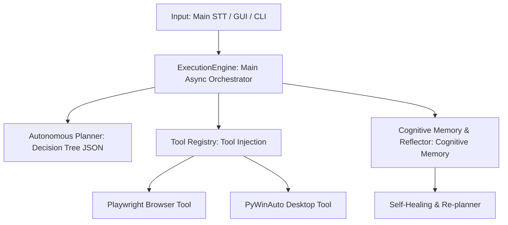

# 🧠 J.A.R.V.I.S. v12.0 — Autonomous Cognitive OS & Agent Architecture 🚀

[](https://www.python.org)
[](https://docs.python.org/3/library/asyncio.html)
[](https://playwright.dev)
[](https://huggingface.co)
[](https://www.trychroma.com/)

**J.A.R.V.I.S. (Just A Rather Very Intelligent System)** is a **v12.0 Autonomous Cognitive Operating System** and Agent architecture featuring episodic memory, a self-healing re-planning capability, and dynamic tree-based JSON planning that acts completely independently of one-way command scripts.

Fully built on the `asyncio` asynchronous architecture, J.A.R.V.I.S. breaks down complex goals into dynamic sub-task trees to run autonomous tasks across browsers, desktop applications, and system hardware.

---

## 🏛️ Advanced Architecture and Subsystems



### 1. Main Asynchronous Orchestrator (`core/engine.py`)
The core operations hub of the system. Instead of running commands in sequential order, it manages a dynamic asynchronous `TaskQueue`.
*   **Parallel State Tracking:** Concurrently tracks all asynchronous task states using `StateManager`.
*   **Non-Blocking I/O:** Leverages `asyncio.gather()` and async I/O structures to execute audio, interface, and tool operations concurrently without locking each other.
*   **Intelligent Recovery:** Identifies errors during execution and routes them to the automatic re-planning module (`_replan`).

### 2. Autonomous Planner & Tree Structure (`core/planner.py` - Layer 0)
The decision-making mechanism relies on a tree model that forces language model outputs into a strictly-typed JSON format.
*   **Layer 0 (Tree Planning):** The LLM constructs required sub-tasks, parameters, and dependencies to reach the target as a hierarchical tree of `PlanNode` objects.
*   **Layers 1-4 (Regex Fallback):** A backward-compatible Regex parsing engine that keeps the system running even under extreme cases where the LLM output is malformed.

### 3. Cognitive Memory & Self-Reflection (`core/memory.py` & `core/reflector.py`)
Rather than just storing static data, J.A.R.V.I.S. features cognitive reflection and experience-gathering mechanisms:
*   **Self-Reflection (Reflector):** Conducts post-execution analysis after every task or failure to find the root cause, answering questions like *"What went wrong?"* and *"Which tool worked?"*.
*   **Episodic Memory:** Stores experiences, error codes, and successful execution metrics in memory using local vector database semantic matching. It autonomously recalls past solutions when encountering similar tasks.
*   **Personal & Startup Memory:** Securely stores long-term personal data and notifies you of scheduled reminders at system startup using the `[PROTOCOL: REMEMBER]` and `[PROTOCOL: STARTUP_REMINDER]` tools.

### 4. Dynamic Re-planning (Self-Healing)
If an unexpected hurdle occurs during execution (error, rate-limit, website change, etc.):
1.  The task queue is halted (`cancel_all`).
2.  The `Reflector` activates to analyze the error and environment variables.
3.  The resulting analysis and remaining goals are passed to the AI to autonomously generate a **completely new sub-plan**.
4.  J.A.R.V.I.S. continues working along the new path without showing any error screen to the user.

### 🛠️ 5. Stateless Plugin-Based Tool System (`tools/`)
All tools are designed as stateless modules that perform asynchronous intent matching via the `ToolRegistry`:
*   🌐 **`browser_tool.py`**: Headed/headless **Playwright** integration designed for searching engines, scraping data, and web automation.
*   🖥️ **`desktop_tool.py`**: **PyWinAuto** wrappers to control native Windows desktop applications at the OS level.
*   ⚙️ **`system_tool.py`**: Local tools for system resources, hardware states, and filesystem operations.

---

## 🔒 Security and Privacy Policy

J.A.R.V.I.S. operates fully under a **secure local-first** principle:
*   **Local Memory Database:** Memory and semantic experience logs are stored in your local `memory_db/` directory, never sent to external servers.
*   **Sensitive Data Protection (`.gitignore`):** `.env` (API Keys), `contacts.json` (Personal phone and WhatsApp contacts), `.coverage`, and local log/error files are protected by an optimized Git exclude list. There is no risk of accidental leaks to GitHub.

---

## 🚀 Installation and Usage

### 1. Requirements
*   **Python 3.11:** Python 3.11.x is recommended for the best asynchronous performance.
*   **Playwright Installation (For Web Automation):**
    ```bash
    pip install playwright
    playwright install
    ```

### 2. Install Dependencies
```bash
pip install -r requirements.txt
```

### 3. Environment Variables
Create a `.env` file in the root directory to enter your language model and API keys:
```env
OPENAI_API_KEY=your-openai-api-key
# Other API or HuggingFace token info if applicable
```

### 4. Execution Options
*   **Option A (Console Mode):**
    ```bash
    python main.py
    ```
*   **Option B (Interface Mode - GUI):**
    ```bash
    python launch_jarvis.pyw
    ```
*   **Option C (Windows Startup):**
    Double-click the `install_startup.bat` script to configure J.A.R.V.I.S. to automatically run in the background on Windows startup.

---

## 👤 About the Developer

This project is developed by **Oğuz Emir Topuz**.

*   **Age:** 14
*   **Interests & Passions:** A football enthusiast and an advanced software developer.
*   **What He Does:** Works on SaaS applications, modern and elegant websites, and 3D games.
*   **Contact & Portfolio:** [My GitHub Profile](https://github.com/OguzEmir177)

---

⭐ If you like this project, don't forget to give it a star! Development is ongoing.
