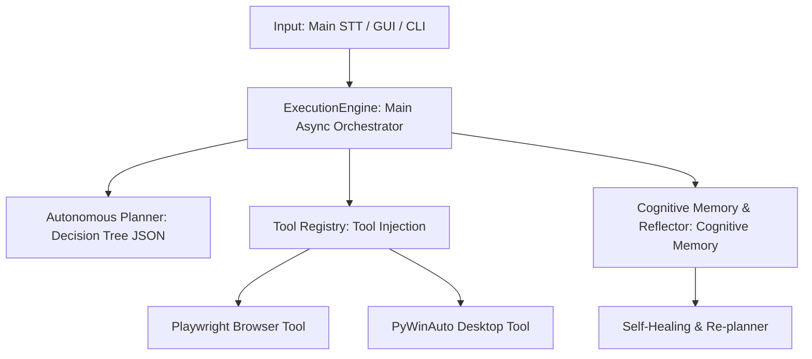

# 🧠 J.A.R.V.I.S. v16.0 — Autonomous Cognitive OS & Agent Architecture 🚀

[](https://www.python.org)
[](https://docs.python.org/3/library/asyncio.html)
[](https://playwright.dev)
[](https://huggingface.co)
[](https://www.trychroma.com/)

**J.A.R.V.I.S. (Just A Rather Very Intelligent System)** is a **v16.0 Autonomous Cognitive Operating System** and Agent architecture featuring episodic memory, a self-healing re-planning capability, and dynamic tree-based JSON planning that acts completely independently of one-way command scripts.

Fully built on the `asyncio` asynchronous architecture, J.A.R.V.I.S. breaks down complex goals into dynamic sub-task trees to run autonomous tasks across browsers, desktop applications, and system hardware.

---

## 📜 Changelog / Güncelleme Geçmişi

### 🌟 v16.0.0 — The AGI Update: Dynamic Skill Synthesizer (Güncel)
* **Kendi Aracını Yazma (Tool Synthesis):** Sistem artık bilmediği bir görevle karşılaştığında pes etmiyor. LLM'i kullanarak o işi yapacak asenkron bir Python kodu (`BaseTool` miras alan) sentezler, `tools/dynamic_skills/` klasörüne kaydeder ve sistemi yeniden başlatmadan (Hot-Reload) `ToolRegistry`'ye enjekte ederek anında çalıştırır.
* **AST Tabanlı Güvenlik Sandbox'ı:** LLM'in ürettiği kodların sistemi ele geçirmesini önlemek adına (Security Vulnerability), kodlar çalıştırılmadan önce *Abstract Syntax Tree (AST)* ile taranır. `eval`, `exec` gibi tehlikeli fonksiyonlar ve izin verilmeyen (whitelist dışı) modül import'ları anında engellenerek Fail-Fast prensibiyle sistemin çökmesi önlenir.
* **Tam Asenkron İzolasyon:** Dinamik kod üretimi, disk yazma ve dinamik modül import (`importlib`) işlemleri tamamen `run_in_executor` arkasına alınarak J.A.R.V.I.S'in event-loop'unu mikrosaniye dahi bloklamaması sağlandı.

### 🚀 v15.0.0 — Autonomous Self-Learning Loop (Dynamic Embedding Cache)
* **Kendi Kendini Eğiten Yönlendirici (Self-Learning Router):** Semantic Router, `Dynamic Embedding Cache` ile entegre edildi. Sistem bilemediği (Confidence < %65) komutları LLM'e devrettikten sonra, başarılı bir şekilde çalışan komutları ve argümanlarını (`Kullanıcı Cümlesi -> Tool Tag + Args`) lokal bir JSON veritabanına asenkron I/O mimarisiyle kaydeder.
* **Akıllı Budama (Pruning) ve RAM Kontrolü:** Otonom cache limiti 1000 komutla sınırlandırıldı. Kapasite dolduğunda "Least-Recently Used / Least Frequently Used" mantığı ile en az değer taşıyan vektörler otomatik olarak budanır, bu sayede RAM ve Disk şişmesi önlenir.
* **Fail-Fast (Hızlı Çökme) Prensibi Entegrasyonu:** Tüm veri yükleme aşamaları sahte `except: pass` bloklarından arındırılarak bozuk veri durumunda sistemin direkt çökerek anında tepki vermesi sağlandı.

### 🧠 v14.0.0 — Lokal Semantic Router (Zero-Latency Yönlendirme)
* **LLM Bağımsız (Zero-Cost) Yönlendirme:** Spagetti (Karmaşık If/Else ve Regex yığını) kodlarına sahip olan eski `AutonomousToolRouter` sistemden tamamen silindi! Yerine saf makine öğrenmesi tabanlı (`scikit-learn` TF-IDF ve Cosine Similarity) **`SemanticRouter`** entegre edildi.
* **Milisaniyelik Yanıt Süresi:** Basit ve net komutlar ("Google'ı aç", "PC'yi kapat", "Müziği durdur"), LLM'e (GroqBrain) gitmek yerine *lokal vektör uzayında milisaniyeler içinde eşleştirilir ve doğrudan çalıştırılır.*
* **Ambiguity Gate (Akıllı Güvenlik Kapısı):** Router güven skoru %65'in altındaysa (yani komut karmaşıksa) sistem komutu otomatik olarak LLM'e (GroqBrain) Fallback (devir) yapar. LLM sadece gerçekten zeka gerektiren görevler için kullanılır.

### 🛡️ v13.3.0 — Kurumsal "Fail-Fast & Async" Mimari Güncellemesi
* **Fail-Fast (Hızlı Çökme) Prensibi:** `core/brain.py` ve `core/engine.py` modüllerindeki bağlantı testlerinde amatörce hata yutan `except: pass` mantığı tamamen silindi. API veya model hataları durumunda sistem kısıtlı modda çalışmak yerine, kurumsal standartlarda dürüstçe çöker ve kullanıcıya net bir log (`SystemError`) döndürür.
* **Async Uyum & Darboğaz (Bottleneck) Çözümü:** Başlangıçta dosya okuma (I/O) işlemlerinin `event-loop`'u blokladığı bir vizyonsuzluk tespit edildi (`_check_startup_reminders`). Tüm I/O işlemleri kurumsal asenkron standartlarına çekilerek `run_in_executor` ile Event-Loop zehirlenmesinden kurtarıldı.
* **Hata Ayıklama Yeteneği Artırıldı:** Sistem çöktüğünde üretilen loglar, sorunun nerede (API mi, model mi, internet mi) kaynaklandığını netleştiren detaylara kavuştu.


---

## 🆕 What's New in v13.2 — Project "Ghost Shield"

J.A.R.V.I.S. v13.2 introduces critical improvements to the voice interaction layer and update management:

### 1. 🛡️ Whisper Hallucination Shield ("Ghost Shield")
* **Low-Energy RMS Gate:** Prevents silent or low-volume audio bytes from being sent to the Whisper API. If the audio level is below **350 RMS**, the pipeline discards it instantly locally, saving API token costs and bandwidth.
* **Semantic Blocklist:** Autonomously detects and blocks common Turkish Whisper silence hallucinations such as *"altyazı m.k."*, *"like atın"*, *"abone ol"*, and English defaults like *"thanks for watching"*.
* **Smart Noise Gate:** Automatically discards short voice signals containing only vocal fillers (`ıı`, `ee`, `yani`, etc.) to prevent false intent activations.

### 🔄 2. One-Click Auto-Updater (`update.py`)
No Git? No problem! J.A.R.V.I.S. now ships with a native, zero-dependency update orchestrator.
* **How it works:** Simply run `python update.py`. The script downloads the latest repository code from GitHub, validates file hashes, and safely replaces modified files.
* **Zero Personal Data Leak:** The updater **never** touches or overwrites your personal configuration files (`.env`, `contacts.json`), local memories (`memory_db/`), or recorded logs.
* **Auto-Backup:** Creates an instant backup of your custom modifications in `_jarvis_backup/` before applying updates.

---

## 🏛️ Advanced Architecture and Subsystems



### 1. Main Asynchronous Orchestrator (`core/engine.py`)
The core operations hub of the system. Instead of running commands in sequential order, it manages a dynamic asynchronous `TaskQueue`.
*   **Parallel State Tracking:** Concurrently tracks all asynchronous task states using `StateManager`.
*   **Non-Blocking I/O:** Leverages `asyncio.gather()` and async I/O structures to execute audio, interface, and tool operations concurrently without locking each other.
*   **Intelligent Recovery:** Identifies errors during execution and routes them to the automatic re-planning module (`_replan`).

### 2. Autonomous Planner & Tree Structure (`core/planner.py` - Layer 0)
The decision-making mechanism relies on a tree model that forces language model outputs into a strictly-typed JSON format.
*   **Layer 0 (Tree Planning):** The LLM constructs required sub-tasks, parameters, and dependencies to reach the target as a hierarchical tree of `PlanNode` objects.
*   **Layers 1-4 (Regex Fallback):** A backward-compatible Regex parsing engine that keeps the system running even under extreme cases where the LLM output is malformed.

### 3. Cognitive Memory & Self-Reflection (`core/memory.py` & `core/reflector.py`)
Rather than just storing static data, J.A.R.V.I.S. features cognitive reflection and experience-gathering mechanisms:
*   **Self-Reflection (Reflector):** Conducts post-execution analysis after every task or failure to find the root cause, answering questions like *"What went wrong?"* and *"Which tool worked?"*.
*   **Episodic Memory:** Stores experiences, error codes, and successful execution metrics in memory using local vector database semantic matching. It autonomously recalls past solutions when encountering similar tasks.
*   **Personal & Startup Memory:** Securely stores long-term personal data and notifies you of scheduled reminders at system startup using the `[PROTOCOL: REMEMBER]` and `[PROTOCOL: STARTUP_REMINDER]` tools.

### 4. Dynamic Re-planning (Self-Healing)
If an unexpected hurdle occurs during execution (error, rate-limit, website change, etc.):
1.  The task queue is halted (`cancel_all`).
2.  The `Reflector` activates to analyze the error and environment variables.
3.  The resulting analysis and remaining goals are passed to the AI to autonomously generate a **completely new sub-plan**.
4.  J.A.R.V.I.S. continues working along the new path without showing any error screen to the user.

### 🛠️ 5. Stateless Plugin-Based Tool System (`tools/`)
All tools are designed as stateless modules that perform asynchronous intent matching via the `ToolRegistry`:
*   🌐 **`browser_tool.py`**: Headed/headless **Playwright** integration designed for searching engines, scraping data, and web automation.
*   🖥️ **`desktop_tool.py`**: **PyWinAuto** wrappers to control native Windows desktop applications at the OS level.
*   ⚙️ **`system_tool.py`**: Local tools for system resources, hardware states, and filesystem operations.

---

## 🔒 Security and Privacy Policy

J.A.R.V.I.S. operates fully under a **secure local-first** principle:
*   **Local Memory Database:** Memory and semantic experience logs are stored in your local `memory_db/` directory, never sent to external servers.
*   **Sensitive Data Protection (`.gitignore`):** `.env` (API Keys), `contacts.json` (Personal phone and WhatsApp contacts), `.coverage`, and local log/error files are protected by an optimized Git exclude list. There is no risk of accidental leaks to GitHub.

---

## 🚀 Installation and Usage

### 1. Requirements
*   **Python 3.11:** Python 3.11.x is recommended for the best asynchronous performance.
*   **Playwright Installation (For Web Automation):**
    ```bash
    pip install playwright
    playwright install
    ```

### 2. Install Dependencies
```bash
pip install -r requirements.txt
```

### 3. Environment Variables
Create a `.env` file in the root directory to enter your language model and API keys:
```env
OPENAI_API_KEY=your-openai-api-key
# Other API or HuggingFace token info if applicable
```

### 4. Execution Options
*   **Option A (Console Mode):**
    ```bash
    python main.py
    ```
*   **Option B (Interface Mode - GUI):**
    ```bash
    python launch_jarvis.pyw
    ```
*   **Option C (Windows Startup):**
    Double-click the `install_startup.bat` script to configure J.A.R.V.I.S. to automatically run in the background on Windows startup.

---

## 🔄 How to Update & Backup Guide

### ⚠️ What Data to Back Up First
Before upgrading to a new version of J.A.R.V.I.S., always back up the following critical files and folders to keep your memory database, API keys, and settings secure:
1. **`.env`**: Contains your AI API keys, configurations, and environment variables.
2. **`memory_db/` (Folder)**: Contains your local vector database which stores all your episodic memories, past experiences, and learned behaviors.
3. **`contacts.json`**: Contains your saved contact details for communications and integration tools.

### 🚀 Step-by-Step Update Process

#### Method A: If Installed via Git (Recommended)
1. **Back up your data:** Copy `.env`, `contacts.json`, and the `memory_db/` directory to a secure temporary folder outside your project path.
2. **Pull the latest version:**
   ```bash
   git stash
   git pull origin main
   git stash pop
   ```
3. **Restore your data:** Place your backed-up `.env`, `contacts.json`, and `memory_db/` folder back into the root of the project.
4. **Update packages:**
   ```bash
   pip install -r requirements.txt --upgrade
   ```
5. **Re-launch J.A.R.V.I.S.:** Launch using your preferred console or GUI options.

#### Method B: If Downloaded as a ZIP
1. **Save your files:** Copy `.env`, `contacts.json`, and the `memory_db/` directory to a safe place.
2. **Download & Extract:** Download the latest J.A.R.V.I.S. ZIP file from the official repository and extract it.
3. **Replace files:** Copy the new folders and files over your current installation directory.
4. **Restore settings:** Move your saved `.env`, `contacts.json`, and `memory_db/` folder back into the project root folder.
5. **Update packages:**
   ```bash
   pip install -r requirements.txt --upgrade
   ```

---

## 👤 About the Developer

This project is developed by **Oğuz Emir Topuz**.

*   **Age:** 14
*   **Interests & Passions:** A football enthusiast and an advanced software developer.
*   **What He Does:** Works on SaaS applications, modern and elegant websites, and 3D games.
*   **Contact & Portfolio:** [My GitHub Profile](https://github.com/OguzEmir177)

---

⭐ If you like this project, don't forget to give it a star! Development is ongoing.
