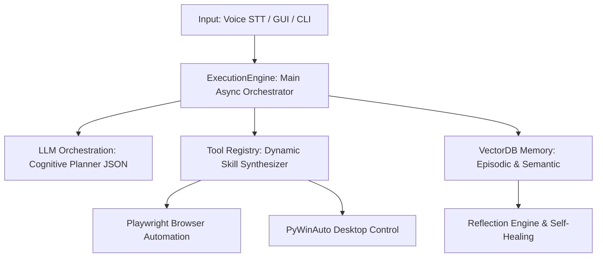

# 🧠 J.A.R.V.I.S. Cognitive OS — The Next-Generation Autonomous Agent Architecture 🚀

[](https://www.python.org)
[](https://docs.python.org/3/library/asyncio.html)
[](https://playwright.dev)
[](https://huggingface.co)
[](https://www.trychroma.com/)

> **The Era of Simple Chatbots is Over. Welcome to True Autonomy.**

**J.A.R.V.I.S. (Just A Rather Very Intelligent System)** is an elite, state-of-the-art **Cognitive AI Operating System** designed to bridge the gap between static LLM chatbots and fully autonomous, self-healing digital entities. Built on a non-blocking asynchronous architecture, J.A.R.V.I.S. autonomously navigates web browsers, manipulates desktop environments, synthesizes new skills on the fly, and reflects on its own failures to learn and adapt.

---

## 🚀 Live Demo
*(Insert your live demo link, GIF, or YouTube video link here to showcase the Cognitive AI OS in action!)*

[▶️ Watch J.A.R.V.I.S. in Action](#)

---

## 🛑 The Core Problem: Why Chatbots Fail

Traditional chatbots act as passive responders—they wait for prompts and output raw text. They lack context, persistence, and agency. When they encounter an error (like a website structure changing), they crash and require human intervention. 

**J.A.R.V.I.S. Solves This:** By shifting from a conversational model to an **LLM Orchestration Framework**, J.A.R.V.I.S. acts independently. It breaks down high-level objectives into actionable sub-tasks, delegates them to stateless tools, and continuously monitors execution state.

---

## 🏛️ Elite Architecture & Subsystems



### 🧠 LLM Orchestration & Dynamic Tree Planning
The execution pipeline is not sequential; it is dynamic. High-level directives are parsed by the orchestration layer into a strict hierarchical tree of `PlanNode` objects. This allows the OS to tackle multi-step operations efficiently, routing complex tasks to the LLM and simpler tasks directly to local semantic routers in milliseconds.

### 🪞 The Reflection Engine (Self-Healing System)
Errors are no longer dead ends. When a sub-task fails (e.g., an API timeout or UI change), J.A.R.V.I.S. triggers the **Reflection Engine**:
1. It halts the asynchronous task queue.
2. It analyzes the error logs and environment context autonomously.
3. It generates a **completely new sub-plan** to bypass the hurdle.
4. Execution resumes along the new path with zero human intervention required.

### 💾 Cognitive Memory Subsystems
J.A.R.V.I.S. possesses true episodic memory:
*   **Episodic Recall:** Every success and failure is embedded in a local Vector Database. The system autonomously recalls past solutions when facing similar future obstacles.
*   **Self-Learning Router:** Automatically prunes obsolete vectors using LFU/LRU caching to maintain absolute efficiency, operating within a secure local-first environment without ever leaking personal data.

---

## 💎 Value Proposition

*   **Absolute Autonomy:** No more hand-holding. Set the objective and let the OS figure out the execution tree.
*   **Infinite Modularity (Dynamic Skill Synthesizer):** If J.A.R.V.I.S. encounters an unknown tool requirement, it uses the LLM to write its own asynchronous Python tools on the fly, applies strict AST-sandbox security checks, and hot-loads them into the registry.
*   **Zero-Latency Fallbacks:** The machine learning-based Semantic Router handles standard commands instantly. The LLM is invoked **only** for complex cognitive benchmarks, optimizing both speed and API costs.
*   **Ironclad Security:** Un-bypassable AST validation prevents LLM-generated code from escaping the sandbox. Dunder attributes and critical system commands are instantly blocked.

---

## ✨ Latest Enhancements (v16.3.0)

> [!IMPORTANT]
> **STT Translation & Proactive Watcher Stability**
> * **[System] STT Initialization Logs:** Translated the Groq Whisper & Fallback Google Web Speech API initialization logs to English to ensure a fully unified English system/console experience.
> * **[Stability] Proactive Watcher Idle Fix:** Fixed a critical bug where the Proactive Watcher would mistakenly assume the user wanted to shut down J.A.R.V.I.S. after exactly 15 minutes of inactivity. Added a strict calibration rule forbidding the `SYSTEM_SHUTDOWN` and `SYSTEM_POWER` protocols during background proactive cycles.

*(For a full list of past version notes including v16.2.0 and v16.1.0, refer to the Changelog section in the codebase.)*

---

## 🔒 Security and Privacy Policy

J.A.R.V.I.S. operates fully under a **secure local-first** principle:
*   **Local Memory Database:** Memory and semantic experience logs are stored in your local `memory_db/` directory, never sent to external servers.
*   **Sensitive Data Protection (`.gitignore`):** `.env` (API Keys), `contacts.json` (Personal contacts), and local log/error files are protected by an optimized Git exclude list.

---

## 🚀 Installation and Usage

### 1. Requirements
*   **Python 3.11:** Highly recommended for optimal asynchronous performance.
*   **Playwright Installation (For Web Automation):**
    ```bash
    pip install playwright
    playwright install
    ```

### 2. Install Dependencies
```bash
pip install -r requirements.txt
```

### 3. Environment Variables
Create a `.env` file in the root directory:
```env
OPENAI_API_KEY=your-openai-api-key
```

### 4. Execution Options
*   **Console Mode:** `python main.py`
*   **Interface Mode (GUI):** `python launch_jarvis.pyw`
*   **Windows Startup:** Run `install_startup.bat` to configure background startup.

---

## 🌌 Connected Projects & Sister Ecosystems
If you like **J.A.R.V.I.S.**, check out my other advanced ecosystem:
* **[YT Analiz Pro - SaaS Edition](https://github.com/oguzemirtopuz/YouTube-Analiz-Uygulamasi-Saas-Edition):** A full-stack YouTube Growth Ecosystem combining a Python FastAPI/OpenCV Desktop App with a Viral Cloning Chrome Extension. Features advanced Multi-Agent Debate for hook generation and custom NLP Chaos Metrics! 🚀

---

## 👤 About the Developer

This state-of-the-art framework is developed by **Oğuz Emir Topuz**.

*   **Age:** 14
*   **Interests & Passions:** A football enthusiast and an advanced software developer.
*   **What He Does:** Works on SaaS applications, modern and elegant websites, and 3D games.
*   **Contact & Portfolio:** [My GitHub Profile](https://github.com/OguzEmir177)

---

⭐ If you believe in the future of autonomous systems, don't forget to star this repository!
